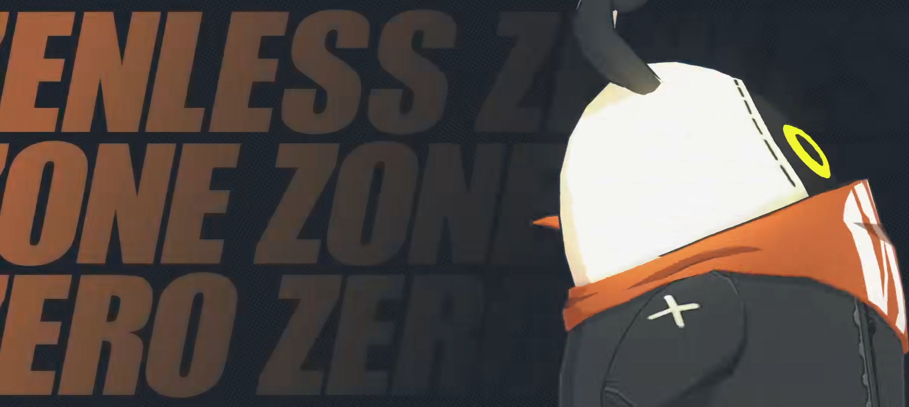
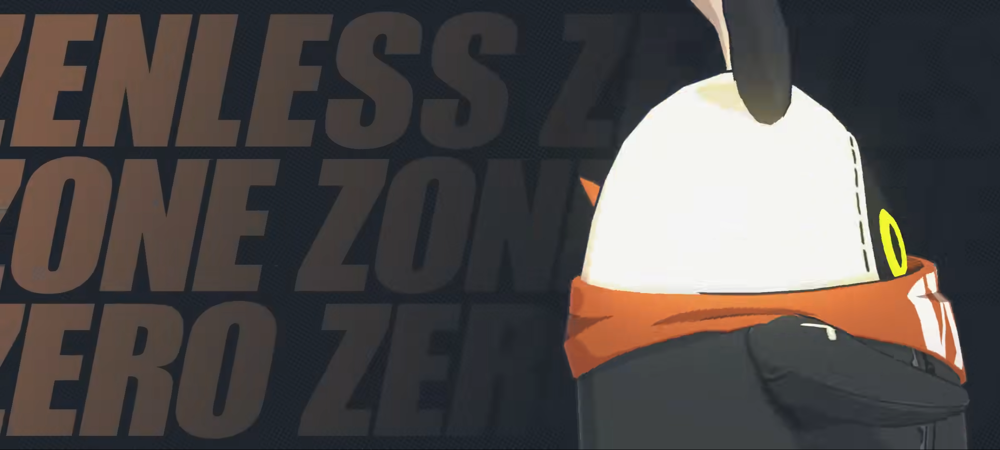
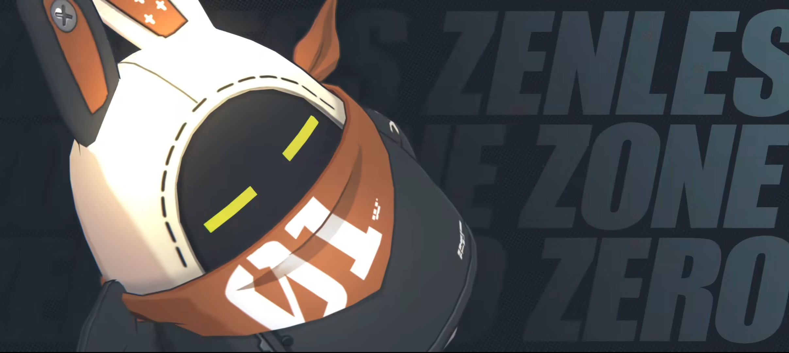
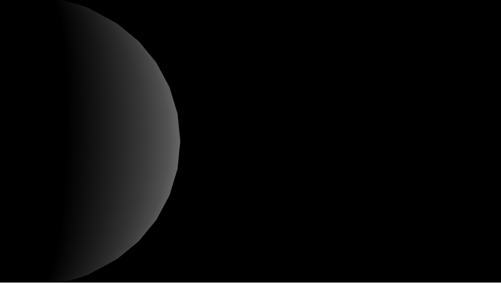
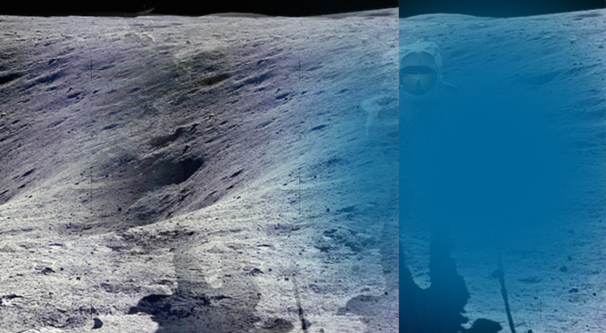

# wshi0890_TUT2_Quiz_8

**I start the design research for my major assignments. This is my research report.**

- [wshi0890\_TUT2\_Quiz\_8](#wshi0890_tut2_quiz_8)
  - [PART 1: Imaging Technique Inspiration](#part-1-imaging-technique-inspiration)
  - [PART 2: Coding Technique Exploration](#part-2-coding-technique-exploration)

## PART 1: Imaging Technique Inspiration
My inspirations come from a Promotional Video for the game [***Zenless Zone Zerod***](https://www.youtube.com/watch?v=C5WS9Ohb-fI). The game isn't even official issued yet, but when it's first Promotional Video was posted, I was very attracted by some of the images in it. So I think some of the imaging techniques used in it that I can learn. 

According to the assignment requirements, I would like to use layered geometric patterns in the final project, and this case has the layered appearance. It also used a fading effect so that the overall image looks smooth and does not seem stiff.

Here are some screenshots of the Promotional Video:

## PART 2: Coding Technique Exploration
I would like to use the code to make an effect similar to the screenshot above: The image follows the mouse slide panning left and right, at the same time the image or the text of the next layer appears, and the next layer image can produce a fading effect.

I didn't find code that directly implements my idea, but I found several codes that combined have the potential to achieve the effect I described.

The following two screenshots show two code examples of possible implements of the imaging technique. The first code can realize the effect of fading based on the mouse slide, and the second code can realize the movement and masking of the two layers. Click on the titles to see the detail codes:

1. [Directional](https://p5js.org/examples/lights-directional.html)

2. [Alpha Mask](https://p5js.org/examples/image-alpha-mask.html)

**In conclusion, this is only a primary concept, and there are still many details that need to be more refined in future work.**

 